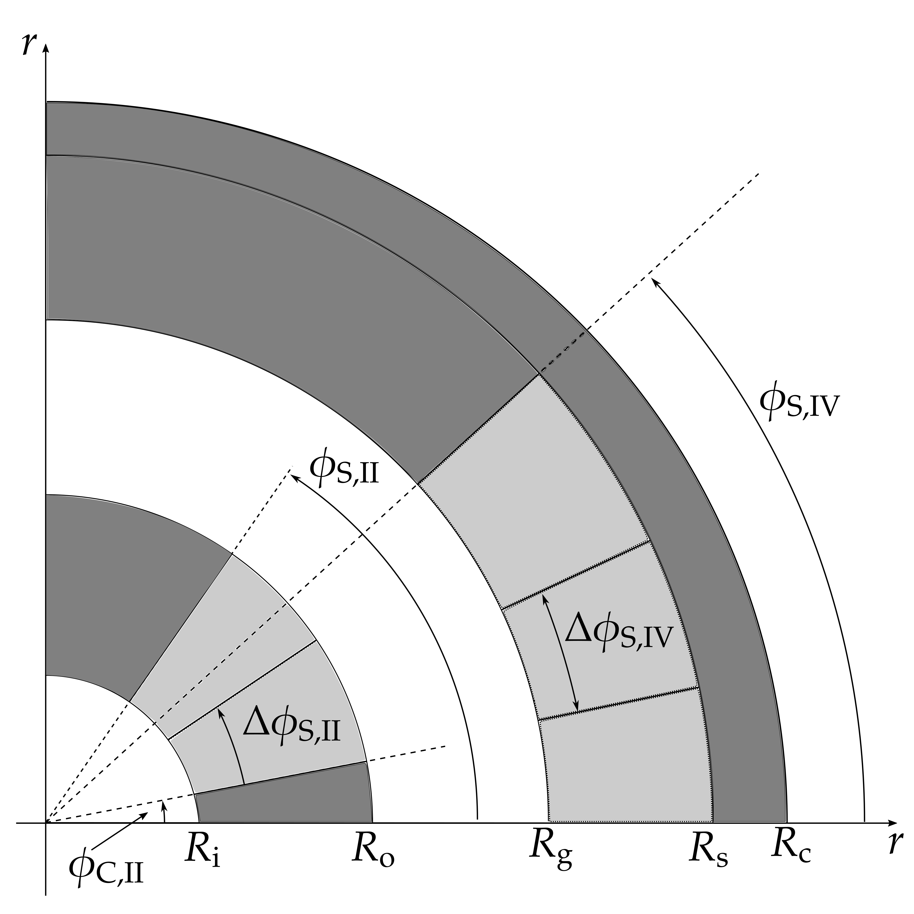

# TeslaMax

Design and simulate nested Halbach cylinders with COMSOL

The problem geometry is represented by the following figure:

This figure shows the first quadrant for simplicity, but TeslaMax simulates the half-circle (first and second quadrants); a mirror symmetry is assumed at the horizontal line between the top and bottom half-circles. The geometry (shapes of the segments) is also symmetric between the first and second quadrants, but the properties of magnet blocks may vary.

## Compiling and running via the Java program

The main Java file `java/TeslaMax.java` contains a description of a COMSOL model, from building the geometry to running the results. This file must be compiled with tools available in the COMSOL installation. The COMSOL command line executables (for Windows) are found on:

	C:\Program Files\COMSOL\COMSOL52a\Multiphysics\bin\win64

Add this directory to your PATH. Notice that `52a` must be replaced by your most current version.

To compile the Java source file:

	comsolcompile java/TeslaMax.java

This will result into a Java `.class` file, which you can open normally with COMSOL (as if you are opening a `.mph` file). Alternatively, you can run:

	comsolbatch -inputfile java/TeslaMax.class -outputfile <basename>

This will run COMSOL in *batch* mode, without the graphical interface. If everything is successful, you have a `<basename>_Model.mph` file (in the current directory) that you can load into COMSOL to see the results. If you do not specify the `-outputfile` option, the file will be saved as `java/TeslaMax_Model.mph`.

Notice that you can run the above command from any working directory, as long as you specify the full path to the input Java file. The source file `TeslaMax.java` is configured to read and write files from/to the current working directory.

## Input and output files

This repository contains a `teslamax-play` repository, with examples of files that are read and written by COMSOL. You should be able to run the `comsolbatch` command described previously inside this directory.

### Parameter file

Fist, you have to provide a `params.txt` file with all required parameters. This repository includes a sample file `teslamax-play/params.txt` that you can use as a reference. Every line has the following format:

    name value

where value is always in the SI. The `name` is taken from the above figure, spelling out the greek letters (e.g. `phi_S_II 45`).

For properties relative to the magnets, the following convention is used:

* `II` and `IV` represent inner and outer magnets, respectively
* the numbering '1', '2', '3', etc starts at the bottom-most segment for each segment
* '1Q' and '2Q' represent the quadrants.
 
Hence, for example, `B_rem_II_1_1Q` is the remanence magnitude (in teslas) of the bottom-most magnet segment for the first quadrant of the inner magnet. The number of segments is controlled by `n_II` and `n_IV`. `alpha_rem_IV_2_2Q` is the angle of the remanence vector in the second segment of the second quadrant of the outer magnet.

The only "non-numerical" parameter is `linear_iron`; it should be set to 1 if the iron regions are to be considered linear and 0 otherwise.

### Output files

The TeslaMax model will output a list of files to the current directory. All files have SI units and the header lines are always preceded by `%`.

* `B_high.txt`: values of the magnetic flux density at the high field region of the magnetic gap (first quadrant). Columns: $x$, $y$, $B$;
* `B_low.txt`: values of the magnetic flux density at the low field region of the magnetic gap (first quadrant). Columns: $x$, $y$, $B$;
* `B_III.txt`: components of the magnetic field in the air gap (first and second quadrant). Columns: $x$, $y$, $B_x$, $B_y$, $H_x$, $H_y$;
* `H_II_1Q.txt`: values of the magnetic fields in the segments of magnet II in the first quadrant. Columns: $x$, $y$, $B_x$, $B_y$, $H_x$, $H_y$, $B_rem_x$, $B_rem_y$;
* `H_IV_1Q.txt`: values of the magnetic fields in the segments of magnet IV in the first quadrant. Columns: $x$, $y$, $B_x$, $B_y$, $H_x$, $H_y$, $B_rem_x$, $B_rem_y$;
* `COMSOL Main Results.txt`: values of global results for the simulation, in a table-like fashion

## Jupyter notebook

The Jupyter notebook `teslamax.ipynb` contain a "Python interface" to the TeslaMax model. In the first cells there are constants and variables that you can customize depending on your installation paths.

This notebook is primarily meant for prototyping purposes. There are two mains to use this notebook:

### Command interface

The main function defined in the notebook is `run_teslamax_from_params(params_dict,verbose)`. This function takes as arguments a dictionary, where the keys are the names of the parameters as decribed in the first column of the parameters file, and a boolean variable to indicate if the output from COMSOL is to be shown. After calling this function, the output files are created as described in the previous section.

### Object interface

There is a `TeslaMaxModel` class; its constructor is called as `TeslaMaxModel(params_dict, path)`, where the first argument is the same as in the command interface and the `path` string indicated where the input and output files are to be saved. This class is still under construction, so check its definition to see available fields and methods.

