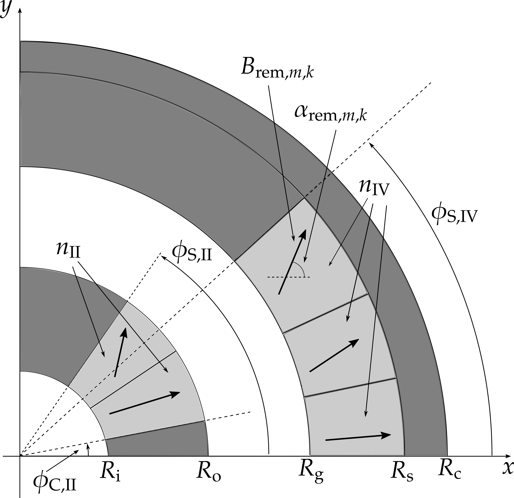

# TeslaMax

Design and simulate nested Halbach cylinders with COMSOL

The problem geometry is represented by the following figure:



Only the first quadrant is shown due to symmetry. Light gray represents permanent magnet, dark gray represents iron, and white represents air. The geometry is axissymetric, but the remanence directions in the permanent magnet regions are mirrored in special ways: a complete mirror symmetry is applied in the x-axis, and only the y-component of the remanence vector field is reversed across the y-axis (in other words, the x-axis is magnetically insulated, and the y-axis has zero magnetic scalar potential). 

This repository includes tools for simulating the geometry in the COMSOL Multiphysics software and a python package for processing the results. From the remanence information, the COMSOL model calculates the magnetic fields in the domain grid. An air shell is included outside the magnetic circuit to simulate the environment.

## Installation and basic usage

Pre-requisites:

1. Anaconda Python 3.6
2. JDK > 8 (it should work with version 6 and up)
3. COMSOL 5.2a (it doesn't seem to work with COMSOL 5.3!)

Add the COMSOL executable directory to the PATH. This can be normally found at `C:\Program Files\COMSOL\COMSOL52a\Multiphysics\bin\win64` (notice the version number).

Then, clone this repository to a directory of choice.

### Compiling and running via the Java program

The main Java file `java/TeslaMax.java` contains a description of a COMSOL model, from building the geometry to running the results. This file must be compiled with tools available in the COMSOL installation, which must be found on your PATH (see  above).

To compile the Java source file:

	comsolcompile java/TeslaMax.java

This will result into a Java `.class` file, which you can open normally with COMSOL (as if you were opening a `.mph` file). Alternatively, you can run:

	comsolbatch -inputfile java/TeslaMax.class -outputfile <basename>

This will run COMSOL in *batch* mode, without the graphical interface. If everything is successful, you have a `<basename>_Model.mph` file (in the current directory) that you can load into COMSOL to see the results. If you do not specify the `-outputfile` option, the file will be saved as `java/TeslaMax_Model.mph`.

Notice that you can run the above command from any working directory, as long as you specify the full path to the input Java file. The source file `TeslaMax.java` is configured to read and write files from/to the current working directory.

### Input and output files

This repository contains a `teslamax-play` repository, with examples of files that are read and written by COMSOL. You should be able to run the `comsolbatch` command described previously inside this directory.

### Parameter file

Fist, you have to provide a `params.txt` file with all required parameters. This repository includes a sample file `teslamax-play/params.txt` that you can use as a reference. Every line has the following format:

    name value

where value is always in the SI. The `name` is taken from the above figure, spelling out the greek letters (e.g. `phi_S_II 45`).

For properties relative to the magnets, the following convention is used:

* `II` and `IV` represent inner and outer magnets, respectively
* the numbering '1', '2', '3', etc starts at the bottom-most segment for each segment
* '1Q' and '2Q' represent the quadrants.
 
Hence, for example, `B_rem_II_1_1Q` is the remanence magnitude (in teslas) of the bottom-most magnet segment for the first quadrant of the inner magnet. The number of segments is controlled by `n_II` and `n_IV`. `alpha_rem_IV_2_2Q` is the angle of the remanence vector in the second segment of the second quadrant of the outer magnet.

The only "non-numerical" parameter is `linear_iron`; it should be set to 1 if the iron regions are to be considered linear and 0 otherwise.

### Output files

The TeslaMax model will output a list of files to the current directory. All files have SI units and the header lines are always preceded by `%`.

* `B_high.txt`: values of the magnetic flux density at the high field region of the magnetic gap (first quadrant). Columns: $x$, $y$, $B$;
* `B_low.txt`: values of the magnetic flux density at the low field region of the magnetic gap (first quadrant). Columns: $x$, $y$, $B$;
* `B_III.txt`: components of the magnetic field in the air gap (first and second quadrant). Columns: $x$, $y$, $B_x$, $B_y$, $H_x$, $H_y$;
* `H_II_1Q.txt`: values of the magnetic fields in the segments of magnet II in the first quadrant. Columns: $x$, $y$, $B_x$, $B_y$, $H_x$, $H_y$, $B_rem_x$, $B_rem_y$;
* `H_IV_1Q.txt`: values of the magnetic fields in the segments of magnet IV in the first quadrant. Columns: $x$, $y$, $B_x$, $B_y$, $H_x$, $H_y$, $B_rem_x$, $B_rem_y$;
* `COMSOL Main Results.txt`: values of global results for the simulation, in a table-like fashion

## Python interface and Jupyter notebooks

A very simple and amateur Python library `teslamax` is used as an interface to the Java model.

The various Jupyter notebooks can be explored to see ways of interacting with the TeslaMax model. Consult the notebooks and explore IPython's help system to inspect the functions and classes available:

```python
In [1]: import teslamax
In [2]: teslamax.<TAB>
```
There are two main ways to use the Python interface and the Jupyter notebooks

### Command interface

The main stand-alone function from the Python library is `run_teslamax_from_params(params_dict,verbose)`. This function takes as arguments a dictionary, where the keys are the names of the parameters as decribed in the first column of the parameters file, and a boolean variable to indicate if the output from COMSOL is to be shown. After calling this function, the output files are created as described in the previous section.

### Object interface

There are two basic classes to represent the TeslaMax model.

The `TeslaMaxPreDesign` class represents a fixed-geometry magnet model, but without any information about the remanence angles. To create an instance:

```python

import teslamax
from teslamax import TeslamaxPreDesign, TeslaMaxModel

params_optimization = {"R_i": 0.015,
                "R_o": 0.060,
                "h_gap": 0.030,
                "R_s": 0.150,
                "h_fc": 0.010,
                "R_e": 2,
                "n_IV": 4,
                "phi_S_IV": 45,
                "n_II": 3,
                "phi_C_II": 15,
                "phi_S_II": 45,
                "mu_r_II": 1.05,
                "mu_r_IV": 1.05,
              "linear_iron": 1,
              "mu_r_iron": 5e3,
             }

n_II = params_optimization["n_II"]
n_IV = params_optimization["n_IV"]

n = n_II + n_IV

B_rem = 1.4

# expand parameters to include remanence magnitudes for each segment
params_optimization = teslamax.expand_parameters_from_remanence_array(B_rem*np.ones(n), 
                                                                      params_optimization, 
                                                                      "B_rem")

tmpd = TeslaMaxPreDesign(params_optimization)
```

Remember that all units are in SI.

Notice the use of the function `teslamax.expand_parameters_from_remanence_array(array, dictionary,preffix)`. We want to enforce the same remanence magnitude for all segments, but instead of manually creating fields like `B_rem_II_1`, `B_rem_II_2` etc, we use this function to expand a given array into a given dictionary, adding a preffix. The first element of the array will be assigned to the key `<preffix>_II_1`, the second to `<preffix>_II_2` and so on, first filling up for the magnet II segments, and then for the magnet IV. There is no check for the right number of elements.

The class instance is created passing this dictionary to the constructor.

Notice that this class cannot be "simulated", but there are a lot of quantities that can be calculated. Type `tmpd.<TAB>` to inspect the available methods. As an example, type `tmpd.calculate_functional?`.

To actually realize the model, you have to instatiate the `TeslaMaxModel` class, passing an array of remanence angles (one element for each magnet block, starting the counting at the first segment of magnet II) and a path where to store all simulation files (as explained above):

```python
from pathlib import Path
alpha_B_rem = np.zeros(n)

tmm = TeslaMaxModel(tmpd,
                      alpha_B_rem,
                      path=str(Path.home() / "Desktop" / "teslamax-play" )
tmm.run()
phi_vector, B_vector = tmm.get_profile_data().T
```

The `tmm.run()` method will call the `comsolbatch` command described earlier and generate the output files. And the resulting object will store the relevant information about where the files are and how to parse them, so you can get the magnetic profile data as illustrated above.

This work is still under construction. Check the `teslamax` package for more information.


